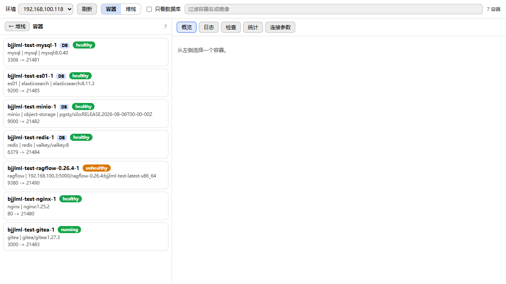
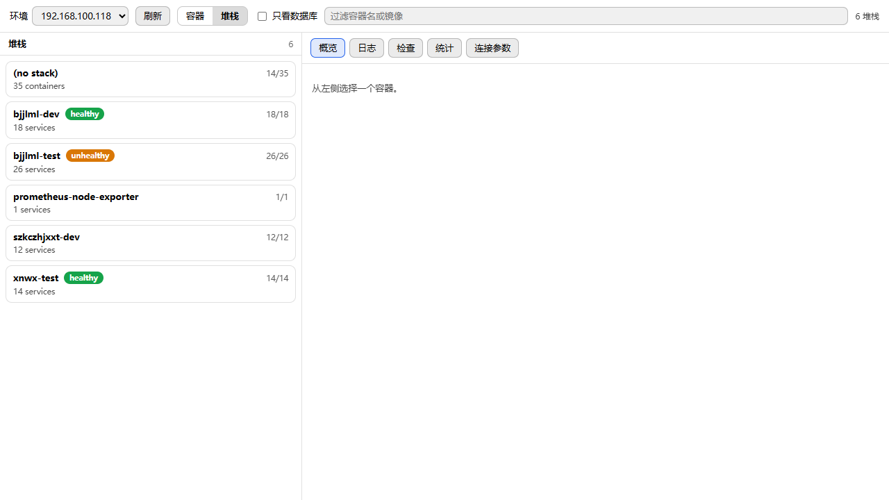
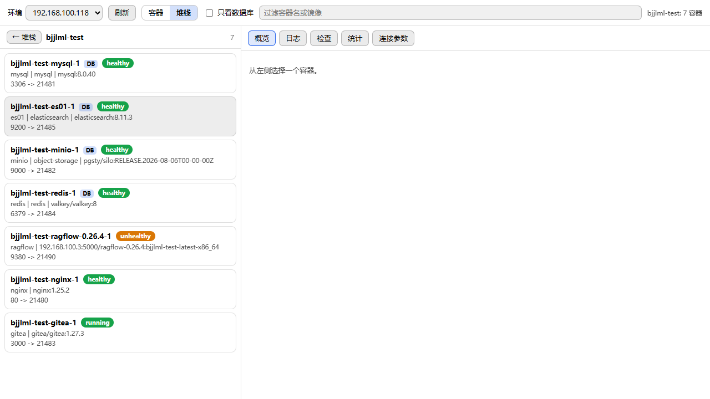
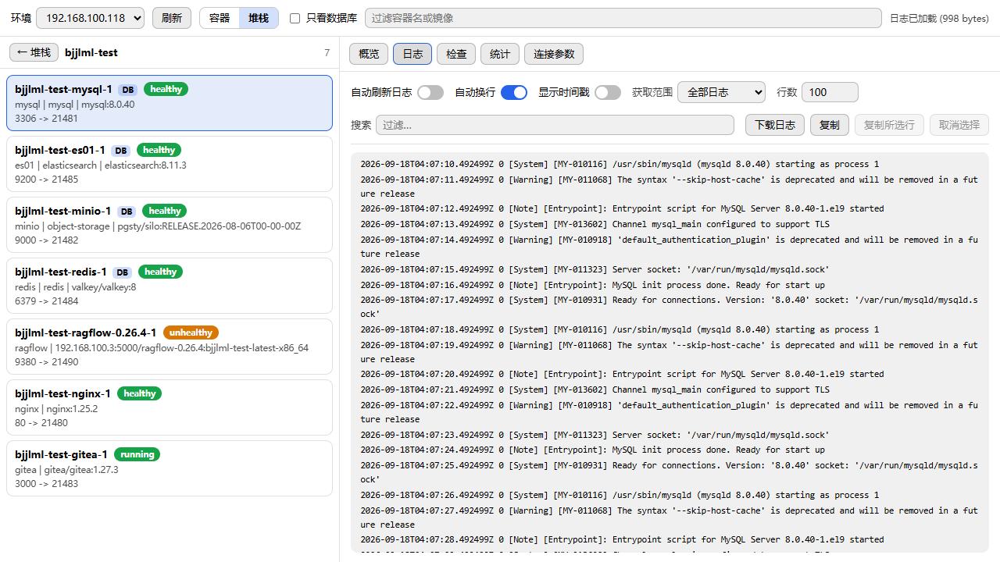

# DBX Portainer Plugin

把 Portainer 环境接进 [DBX](https://dbxio.com)：按堆栈浏览容器、查看健康状态与资源占用、阅读日志，并把数据库容器直接映射成 DBX 连接参数。

DBX 是一个 20 MB 的跨平台数据库客户端，内置 90+ 种数据库驱动、AI 助手、CLI 与 MCP Server。本插件是它的一个第三方扩展。

## 功能

- **环境**：列出 Portainer 的全部 endpoint，含在线状态
- **堆栈视图**：按容器的 `com.docker.compose.project` 标签分组，同时覆盖 Portainer 托管的堆栈与外部部署的 Compose 项目，显示运行数 / 总数与服务数
- **容器视图**：全量容器列表，支持按名称、镜像、服务名过滤，可只看数据库容器
- **状态徽章**：`healthy`、`unhealthy`、`starting`、`running`、`exited` 等，直接取自 Docker 的状态行；无健康检查的容器回退为运行状态
- **数据库识别**：MySQL、MariaDB、Percona、TiDB、PostgreSQL（含 pgvector / Timescale）、Redis / Valkey、MongoDB、Elasticsearch / OpenSearch、ClickHouse、Neo4j、MinIO、SQL Server、Oracle、Kingbase、达梦、Nacos
- **连接参数**：从容器端口映射推导 host / port / 类型，可直接用于在 DBX 中新建连接
- **日志面板**：自动刷新、自动换行、显示时间戳、获取范围（全部 / 最近 1 小时 / 24 小时 / 7 天）、搜索过滤、行数控制、下载、复制、复制所选行、取消选择
- **统计**：CPU、内存、网络 I/O、块设备 I/O、进程数
- **检查**：镜像、状态、重启策略、启动与结束时间、端口映射、挂载、网络、环境变量名
- **日志解码**：正确处理 Docker 的多路复用帧，非 TTY 容器的日志不会出现乱码

## 截图

容器视图（含健康徽章与端口映射）：



堆栈视图：



堆栈内的服务容器：



日志面板：



## 只读设计

当前版本对 Portainer 只发起 `GET` 请求。**不包含任何写操作**：没有容器启停、删除、重建，也没有 `exec` 与 `attach`。

这个约束是有意为之：插件通常被指向生产环境，只读能把风险降到最低。如需写操作，请先开 issue 讨论。

## 安装

### 手动安装（当前方式）

1. 下载 Release 中的 `.dbxp` 包
2. 打开 DBX → 插件中心 → 第三方与开发者选项 → 开启「允许安装未签名开发包」
3. 安装该 `.dbxp` 文件

> 未签名包会以当前用户权限运行原生代码。该开关只影响手动安装的包，不会放宽官方商店的签名校验。

### 从官方商店安装

上架流程完成后可从 DBX 官方插件商店直接安装。

## 构建

需要 Node.js 22+ 与 Go 1.22+。

```bash
npm install --global @dbx-app/plugin-cli
cd dbx-plugin-portainer
dbx-plugin package . --output-dir dist
```

产物：

```
dist/<plugin-id>-<version>-<target>.dbxp
dist/<plugin-id>-<version>-<target>.artifact.json
```

`@dbx-app/plugin-cli` 自带 DBX 官方 Go SDK，打包时会生成 `go.work` 把 `backend/` 与 SDK 一起纳入 workspace。

### 提交前自检

```bash
gofmt -l backend                        # 应无输出
cd backend && go build ./... && go vet ./...
node --check ui/app.js
node tools/verify-manifest.mjs
```

`go build` 需要 `backend/third_party/dbx-plugin-sdk`（仓库内已包含），因此可以离线完成。

## 连接配置

新建连接时选择 **Portainer** 类型，填写：

| 字段 | 说明 |
| --- | --- |
| 协议 | `http` 或 `https`，默认 `http` |
| 主机 | Portainer 的主机名或 IP，不要带协议前缀 |
| 端口 | HTTP 常见 `8000` / `9000`，HTTPS 常见 `9443` |
| API 访问令牌 | 在 Portainer 的「我的账户 → 访问令牌」中创建 |
| 校验 TLS 证书 | 使用自签证书时可关闭，仅建议在可信内网使用 |

令牌保存在 DBX 的 Secret Store 中，不会写入插件配置、日志或事件。

插件同时支持 Portainer 的长期 access token（作为 `X-API-Key` 发送）与 `/api/auth` 签发的会话令牌（作为 `Bearer` 发送），按令牌形态自动选择。

## 目录结构

```
manifest.json               插件清单（connection-provider / workbench / context-menu）
dbx-plugin.toml             打包配置
assets/                     图标
ui/                         沙箱工作台（原生 HTML/CSS/JS，无构建步骤）
backend/main.go             Sidecar 全部逻辑（连接、环境、容器、日志、统计）
backend/mcptools.go         暴露给 AI 客户端的 MCP 工具定义
backend/mcp/                通用 MCP 支撑包（零依赖，可复用到其他插件）
backend/third_party/        DBX 官方 Go SDK 本地副本（Apache-2.0）
tools/verify-manifest.mjs  清单与包结构校验，CI 使用
docs/screenshots/          界面截图
```

## 工作原理

```
DBX 宿主
  └─ 沙箱 iframe（ui/）          只通过 window.dbxPlugin 通信
       └─ Sidecar（backend/main.go）  JSON-RPC over stdio
            └─ Portainer REST API
                 └─ /api/endpoints/{id}/docker/...  → Docker API 网关
```

前端必须经 Sidecar 出网：Portainer 地址由用户自填，无法预先进入 `host.network` 白名单，且自签证书在浏览器沙箱内无法处理。

Sidecar 暴露的方法：

| 方法 | 用途 |
| --- | --- |
| `connection/test` `connect` `disconnect` | 连接生命周期 |
| `portainer/sessions` | 当前已建立的会话 |
| `portainer/endpoints` | 环境列表 |
| `portainer/containers` | 容器列表（含 stack / service / health） |
| `portainer/stacks` | 按 Compose 项目分组的堆栈 |
| `portainer/stackContainers` | 单个堆栈的容器 |
| `portainer/inspect` | 容器详情 |
| `portainer/stats` | 单次资源采样 |
| `portainer/logs` | 容器日志（支持 tail / since / range） |

## MCP 工具（AI 集成）

插件实现了 DBX 的插件 MCP 协议（`mcp/tools` 发现、`mcp/call` 执行），向 AI 客户端提供 9 个只读工具：

| 工具 | 用途 |
| --- | --- |
| `portainer_overview` | 环境概览：容器 / 堆栈 / 数据库数量、运行中与不健康计数、数据库引擎分布 |
| `portainer_list_environments` | 列出环境（endpoint），返回 id、名称、在线状态与主机 |
| `portainer_list_stacks` | 列出 Compose 堆栈及其运行数 / 服务数 / 健康状态 |
| `portainer_list_containers` | 列容器，支持按堆栈、状态、名称、镜像、服务名过滤，可只看数据库容器 |
| `portainer_find_containers` | 按名称模糊查找容器，便于后续 inspect 或读日志 |
| `portainer_find_databases` | 找出数据库容器并推导可直接建连的 host / port / 类型 |
| `portainer_inspect_container` | 容器详情：镜像、状态、重启策略、端口、挂载、网络、环境变量名 |
| `portainer_container_logs` | 读日志，支持时间范围、行数、时间戳与关键字过滤 |
| `portainer_container_stats` | 资源采样：CPU、内存、网络 I/O、块设备 I/O、进程数 |

使用要点：

- 容器参数可传**名称或 ID**；模糊匹配命中多个时会报错并列出候选，不会猜。
- 所有工具都有默认值，只传必填参数即可调用。
- 结果有体积上限，超限会截断并给出缩小范围的提示。
- 工具的凭据由宿主补齐（`mcp/call` 的 `lifecycle` 载荷），不需要在工具参数里传令牌。

### 宿主支持现状

DBX 侧这条链路是分层的：sidecar 协议（`mcp/tools` / `mcp/call`）已定义，`LocalBackend`（`crates/dbx-mcp/src/backend.rs`）已实现发现与调用，桌面桥提供 `POST /call-plugin-tool`，但 **MCP Server 的 `tools/list` 尚未并入插件工具**（`crates/dbx-mcp/src/server.rs` 里目前没有任何插件相关代码）。

因此这些工具要等上游把最后一环接通后，才会出现在 AI 客户端的工具列表里。插件侧的实现是前向兼容的——上游一旦支持，本插件无需再次改动。

### 复用这套接入（给其他插件）

`backend/mcp/` 是刻意写成通用的：它不认识 Portainer，只依赖 Go 标准库。把同样的能力搬到另一个 DBX 插件只需要三步：

1. 复制整个 `backend/mcp/` 目录
2. 新建一个工具文件，用 `mcp.NewRegistry()` 注册工具；处理器可以直接调用插件原有的 sidecar 方法，UI 与 AI 因此共享同一套业务逻辑
3. 在 sidecar 的 `Handle` 中加两个分支：

```go
case "mcp/tools":
    return p.tools.List(), nil
case "mcp/call":
    return mcp.CallAndWrap(p.tools, toStr(values["tool"]), values), nil
```

`mcp` 包提供的辅助函数：`ObjectSchema` / `Prop` / `PropWithDefault` / `PropEnum` 构造 JSON Schema；`RequireString` / `RequireInt` / `StringArg` / `IntArg` / `BoolArg` / `Clamp` 读取参数；`JSONResult` / `TextResult` / `ErrorResult` 封装结果。
## 已知限制

- 只读：不含控制台（exec）与附加（attach）
- 一键创建 DBX 连接尚未接入宿主 API，目前提供参数展示与复制
- 单次日志最多返回 512 KiB，超大日志请调小行数或缩小时间范围
- 连接会话保存在 sidecar 进程内，DBX 重启后需要重新连接
- 容器 ID 会随重建变化，请以容器名作为稳定标识

## 许可

[Apache License 2.0](LICENSE)。第三方组件见 [THIRD_PARTY_NOTICES.md](THIRD_PARTY_NOTICES.md)。